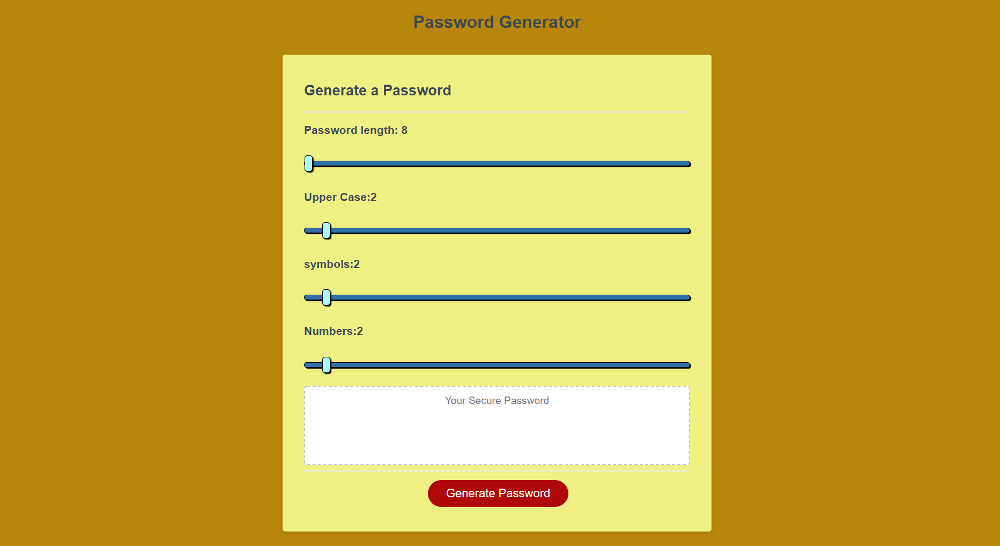

# Password Generator

 

## Description
The goal of this project was to create a password generator using HTML CSS and JavaScript that allowed the user to generate a password between 8-132 characters depending on user input. The user can also specify how many of those characters were upper case, numbers, and symbols.
## Table of Contents
- #### [Description](##-description)
- #### [Installation](##-Installation)
- #### [Usage Information](##-usage-information)
- #### [License](##-license)
- #### [Contributing](##-contributing)
- #### [Tests](##-tests)
- #### [Questions](##-questions)

## Installation
It is an open web page you can visit [Here](https://krestle80.github.io/password_generator/)  

if youd like a local copy feel free to clone it from github
## Usage Information
To use the password generator simply click and drag the sliders to select your password size and content, and click generate password.
## License
Copyright 2022 Kyle Costello
 
 Redistribution and use in source and binary forms, with or without modification, are permitted provided that the following conditions are met:
 
 1. Redistributions of source code must retain the above copyright notice, this list of conditions and the following disclaimer.
 
 2. Redistributions in binary form must reproduce the above copyright notice, this list of conditions and the following disclaimer in the documentation and/or other materials provided with the distribution.
 
 3. Neither the name of the copyright holder nor the names of its contributors may be used to endorse or promote products derived from this software without specific prior written permission.
 
 THIS SOFTWARE IS PROVIDED BY THE COPYRIGHT HOLDERS AND CONTRIBUTORS "AS IS" AND ANY EXPRESS OR IMPLIED WARRANTIES, INCLUDING, BUT NOT LIMITED TO, THE IMPLIED WARRANTIES OF MERCHANTABILITY AND FITNESS FOR A PARTICULAR PURPOSE ARE DISCLAIMED. IN NO EVENT SHALL THE COPYRIGHT HOLDER OR CONTRIBUTORS BE LIABLE FOR ANY DIRECT, INDIRECT, INCIDENTAL, SPECIAL, EXEMPLARY, OR CONSEQUENTIAL DAMAGES (INCLUDING, BUT NOT LIMITED TO, PROCUREMENT OF SUBSTITUTE GOODS OR SERVICES; LOSS OF USE, DATA, OR PROFITS; OR BUSINESS INTERRUPTION) HOWEVER CAUSED AND ON ANY THEORY OF LIABILITY, WHETHER IN CONTRACT, STRICT LIABILITY, OR TORT (INCLUDING NEGLIGENCE OR OTHERWISE) ARISING IN ANY WAY OUT OF THE USE OF THIS SOFTWARE, EVEN IF ADVISED OF THE POSSIBILITY OF SUCH DAMAGE

## Questions
If you have any questions regarding this project please feel free to reach out at 

-Email: kylec0217@gmail.com 
-GitHub Username: krestle80 

